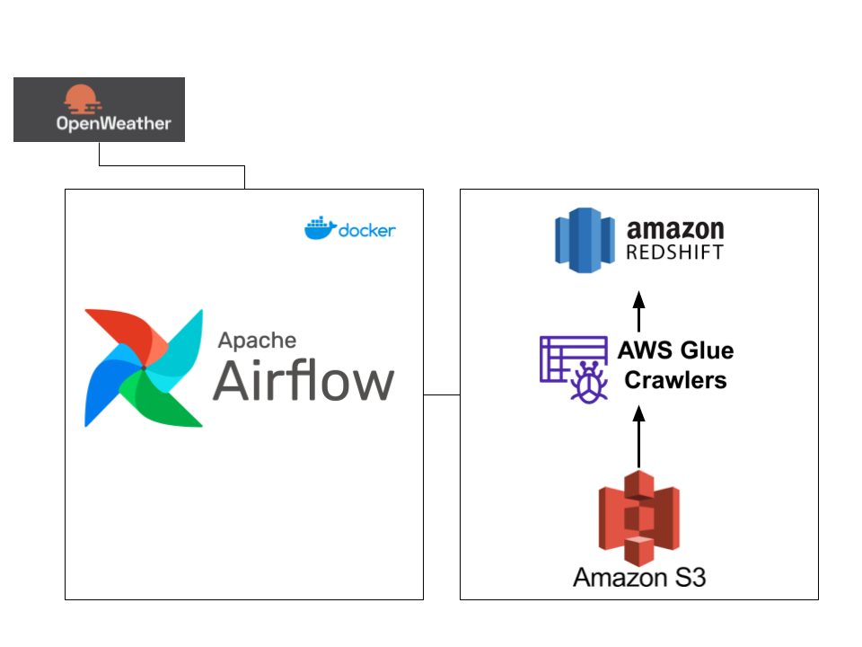

# CSCI-5253 Final Project
Name: Lucas Derr

### Project Overview
Anyone who is an avid skier knows that weather can significantly impact the experience of a day out on the slopes. Knowing the type of weather on the mountain can affect which mountain a skier decides to go to, and sometimes whether to go skiing at all. In this end-to-end data engineering project, daily weather data is pulled from [openweathermap's API](https://openweathermap.org/api) and uploaded to an AWS S3 Bucket using Airflow for orchestration. Once in AWS, it is processed by AWS Glue Crawlers and uploaded in 3rd Normal Form to Redshift. Once in Redshift, the data can be analyzed to determine which ski mountain will have the best weather!

### Architecture Diagram:


### Prerequisites:
- AWS Account with appropriate permissions for S3, Glue, Athena, and Redshift
- openweathermap API credentials.
- Docker Installation
- Python 3.9 or higher

### Running the Code

1. Clone the repository:
   ```bash
   git clone https://github.com/lderr4/CSCI-5253.git
   ```
2. Switch the Final-Project branch:
   ```bash
   git checkout -b Final-Project
   ```
3. Create a virtual environment:
   ```bash
   python3 -m venv venv
   ```
4. Active the virtual environment:
   ```bash
   source venv/bin/activate```
6. Install the dependencies
   ```bash
    pip install -r requirements.txt
   ```
7. Update the config.conf file with the correct API and AWS credentials
   
8. Start the containers
   ```bash
   docker-compose up -d --build
   ```
9. Launch Airflow UI at [http://localhost:8080](http://localhost:8080)
 


